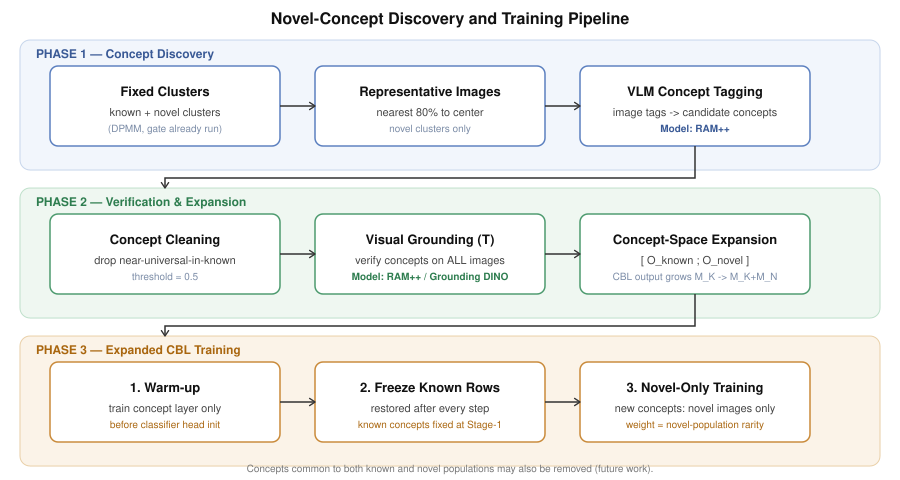

# Novel-Concept Discovery for CBL-based GCD

This branch (`main-novel-concepts`) extends xGCD's Concept Bottleneck Layer (CBL) so it can
describe **novel, undiscovered classes** with new concepts, not just the known classes it was
trained on in Stage 1.

Stage 1 CBL concepts come from Grounding DINO annotations of the *labelled known classes* —
by construction, that vocabulary has no reason to contain words that describe a novel class
(e.g. "truck", "gecko"). This means a novel cluster's LDA prototype and its
`explain_prototype` output are stuck describing it in terms of known-class concepts, even
when none of them really apply. This feature closes that gap: after novel clusters are
discovered (Phase 2 of xGCD), we use a vision-language model to look at the novel images
themselves, propose new concept words with no class label required, clean and verify them,
grow the CBL to output them, and train the new dimensions carefully so they don't disturb the
already-correct known-class behavior.

## Pipeline



**Phase 1 — Concept Discovery.** Starting from the clusters produced by phase 3's DPMM +
peak-gate (already fixed at this point — no DPMM is re-run), we take the images closest to
each novel cluster's center and tag them with **RAM++** (Recognize Anything Model++), an
open-vocabulary image-tagging VLM. Unlike Grounding DINO, RAM++ needs no candidate vocabulary
and no class label — it proposes concept words directly from the image. Per-cluster tag
frequency is aggregated into a candidate list.

**Phase 2 — Verification & Expansion.** Candidate concepts that are near-universal in an
*existing known class* (e.g. "blue", "mammal") are dropped — they don't help distinguish
anything and only add noise to the CBL. The surviving concepts are then checked against the
*full* image set (known + novel) with a grounding/tagging model to build the expanded
concept-presence matrix `O = [O_known ; O_novel]`. The CBL's final linear layer is grown from
`M_known` to `M_known + M_novel` output dimensions to make room for them.

**Phase 3 — Expanded CBL Training.** This is the part that needs the most care, because a
naive joint retrain on the enlarged concept space measurably hurt known-class accuracy in
early experiments (Old-ACC collapsing at epoch 0). The final design uses three mechanisms
together:

1. **Warm-up.** Before the classifier head is (re-)initialized from LDA prototypes, the CBL
   linear layer is trained for a few epochs on the expanded concept space so its output
   for the *new* dimensions is no longer an untrained, essentially-random guess. Skipping
   this caused the prototype for new dimensions to mismatch the CBL's actual (untrained)
   output, which is what caused the Old-ACC collapse.
2. **Freeze the original CBL rows.** The pre-growth rows of the CBL weight/bias are
   snapshotted once and restored after every optimizer step (`FrozenCBLRows`, in
   [`freeze_old_concepts_cbl_utils.py`](project_utils/freeze_old_concepts_cbl_utils.py)).
   This is not gradient-zeroing — SGD's weight decay still nudges a zero-gradient row — so
   restoring the snapshot after each step is what actually keeps known-concept detection
   byte-for-byte identical to Stage 1 throughout Phase 3, regardless of what the optimizer
   does internally.
3. **Novel-only training for new concepts.** The new CBL dimensions are trained only on
   images from novel clusters, never on labelled known-class images. Loss is computed with
   `combined_fidelity_bce(..., novel_only=True)`. The positive/negative class balance
   (`pos_weight` in the BCE loss) for new concepts is computed **from the novel population
   only**, not mixed with labelled images — a concept's weight is the inverse of how often it
   is actually present among the novel images that will supply its training signal.

Together, these three mean the new concepts are learned entirely from what the novel images
actually look like, and the known-class CBL rows — and therefore known-class classification —
are provably unaffected by any of this.

## Concept cleaning: why novel-population pos_weight alone wasn't enough

`pos_weight` in the BCE fidelity loss is `neg/pos` — the inverse of how often a concept is
*present*, measured within some population. Newly discovered concepts were originally weighted
using their frequency in the *labelled* population, which badly underweights a concept that
never occurs there at all (its `pos_weight` degenerates to a neutral `1.0`, since there's no
positive count to divide by), even though it may be a real, frequent signal within the novel
images that actually discovered it. `--novel_pos_weight_from_novel` fixes this by computing
`pos_weight` from the *novel* population instead. Comparing the two for four discovered
concepts:

| Concept | Labelled pos_weight | Novel pos_weight |
|---|---|---|
| food | 36.5 | 32.9 |
| tree frog | 1.0 | **27.1** |
| gecko | 50.0 | 32.3 |
| frog | 1.0 | **46.1** |

This clearly rescues `tree frog` and `frog` — concepts invisible to the labelled population but
real and common within their own novel cluster. It does **not** fix `food`: since `food` occurs
at a similarly low rate in *both* populations (~2.7% labelled, ~2.9% novel), its pos_weight is
high and barely changes either way (36.5 → 32.9). This exposes a real limit of pos_weight
reweighting: it only rebalances how strongly the loss penalizes a missed positive label, based
on that label's rarity within one population — it has no notion of whether the concept is
actually *specific* to the cluster it was discovered from. A concept that's rare-but-generic
still gets a large pos_weight and still gets pushed hard by the loss whenever it's a positive
target, with nothing to suppress it for being uninformative. Reweighting can rescue a concept
the labelled population made invisible, but it cannot remove a concept that's simply
uninformative in both populations — that needs a filter, not a reweighting.

**`--novel_min_enrichment_ratio`** is that filter. It compares a candidate concept's frequency
in the novel population to its frequency in the known population,
`ratio = f_novel(c) / f_known(c)` (a concept with zero known-population hits is treated as
maximally enriched, `ratio = inf`, and always kept), and drops the concept if that ratio falls
below the threshold. This targets a different failure mode than
`--novel_drop_known_universal_thresh`: that filter only catches concepts that are *frequent* in
some known class, so a concept that's simply rare everywhere (like `food`) never trips it.
It's also deliberately a *ratio* test rather than a "seen in both populations" test — genuinely
discriminative novel concepts (`boat`, `horse`, `dog`, `gecko`, ...) routinely have a handful of
noisy, nonzero hits in the labelled set too, so dropping anything nonzero in labelled would
throw away real concepts along with generic ones. Based on ratios computed across a full
discovered-concept list (generic concepts clustering at 0.4x–1.6x, genuinely discriminative ones
at 5x–60x+, with only one borderline case in between), **`2.0`** is a reasonable starting
threshold. Off by default; applied right after the near-universal filter, before the CBL is
grown, and composable with it.

## Key files

| File | Purpose |
|---|---|
| [`project_utils/concept_discovery_utils.py`](project_utils/concept_discovery_utils.py) | RAM++ tagging, candidate filtering, CBL growth, LDA extension, `pos_weight` computation, `combined_fidelity_bce` |
| [`project_utils/freeze_old_concepts_cbl_utils.py`](project_utils/freeze_old_concepts_cbl_utils.py) | `FrozenCBLRows` — snapshot/restore of the original CBL rows |
| [`project_utils/ram_tagging_utils.py`](project_utils/ram_tagging_utils.py) | RAM++ model loading and batched image tagging |
| [`project_utils/grounding_dino_tagging_utils.py`](project_utils/grounding_dino_tagging_utils.py) | Grounding DINO tagging (written, not currently wired in — candidate for the verification step) |
| [`methods/contrastive_training/phase3.py`](methods/contrastive_training/phase3.py) | Orchestrates discovery + warm-up + freezing + training inside the existing Phase 3 loop |

## Relevant CLI args

All new behavior is opt-in — everything defaults to off/0 and reproduces the original Phase 3
training exactly unless explicitly enabled.

| Arg | Default | Effect |
|---|---|---|
| `--novel_concepts` | `False` | Master switch for the whole feature |
| `--novel_min_images_per_cluster` | `2` | Minimum images tagged per novel cluster before it contributes candidate concepts |
| `--novel_drop_known_universal_thresh` | `0.0` | Drop a candidate concept if its frequency in any known class is >= this threshold |
| `--novel_min_enrichment_ratio` | `0.0` | Drop a candidate concept unless its novel-population frequency is >= this many times its known-population frequency |
| `--novel_cbl_warmup_epochs` | `0` | Epochs of CBL-only warm-up before prototype/LDA refit and head init |
| `--novel_cbl_warmup_lr` | `1e-3` | Learning rate for the warm-up |
| `--novel_bce_include_unlabelled` | `False` | Include novel-cluster images in the main BCE loss (not just labelled images) |
| `--novel_freeze_old_cbl` | `False` | Enable `FrozenCBLRows` + novel-only training for new concept dims |
| `--novel_pos_weight_from_novel` | `False` | Compute new concepts' `pos_weight` from the novel population instead of the labelled population |
| `--ram_pretrained`, `--ram_image_size`, `--ram_batch_size` | — | RAM++ model/loading config |
| `--cluster_images_dir`, `--cluster_images_n` | — / `20` | Where to save representative per-cluster images + their finalized concepts for inspection |

## Getting started

```bash
python methods/contrastive_training/phase3.py \
    --novel_concepts \
    --novel_min_images_per_cluster 200 \
    --novel_drop_known_universal_thresh 0.5 \
    --novel_min_enrichment_ratio 2.0 \
    --novel_cbl_warmup_epochs 10 \
    --novel_bce_include_unlabelled \
    --novel_freeze_old_cbl \
    --novel_pos_weight_from_novel \
    <...other existing phase3.py args...>
```

See [`novel_concept_experiments.txt`](novel_concept_experiments.txt) for ablation results on
these flags (CIFAR-10 GCD split: 5 known / 5 novel classes).
